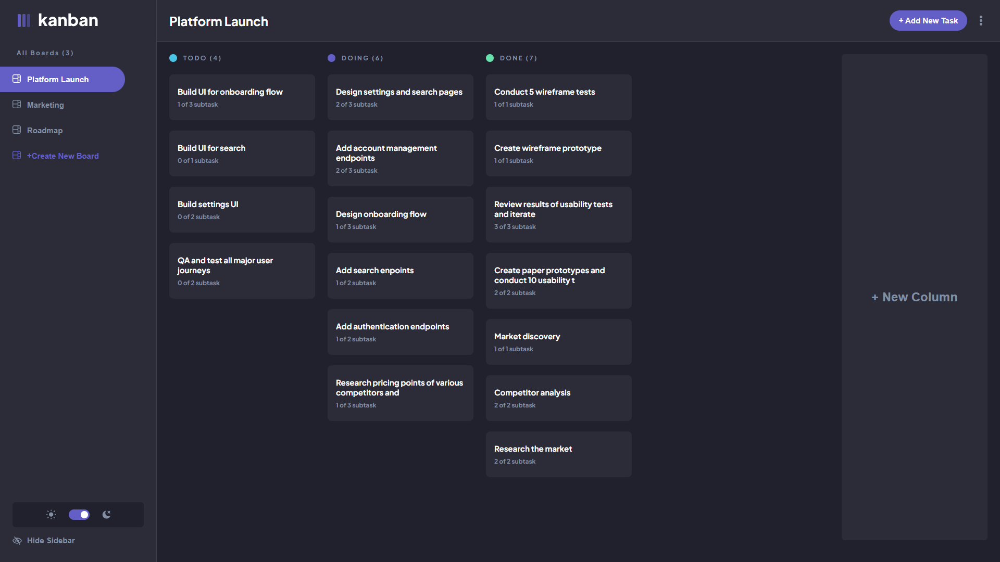

# Todo App

This website is a task management app.

## Project Functionality

User can:

- Create new boards
- Change boards name
- Delete boards
- Add columns to a board
- Change columns name
- Delete columns
- Add new tasks to columns
- Change tasks name and description
- Change tasks status
- Delete tasks
- Add subtasks to tasks
- Edit subtasks
- Mark subtasks as completed
- Delete subtasks
- Choose theme between light and dark

You can visit website by clicking [this link](https://github.com)

## Technology used:

- HTML
- Sass/Scss
- Flexbox
- Js
- React
- React-hooks
- React Hook Form
- Firebase

## How to start

1. Clone the repository:

   `git clone https://github.com/kanae367/todo-app.git`

2. Install all dependencies:

   `npm install`

3. Run the app:

   `npm start`
